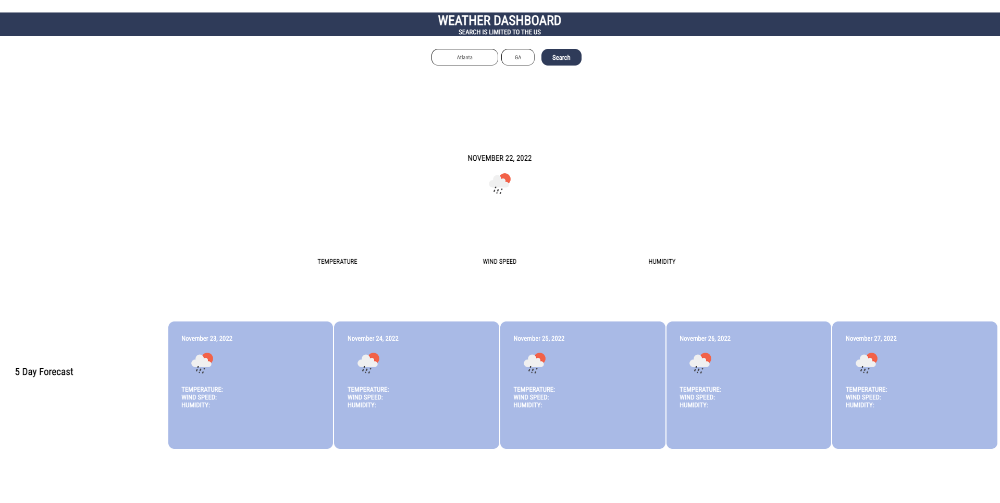
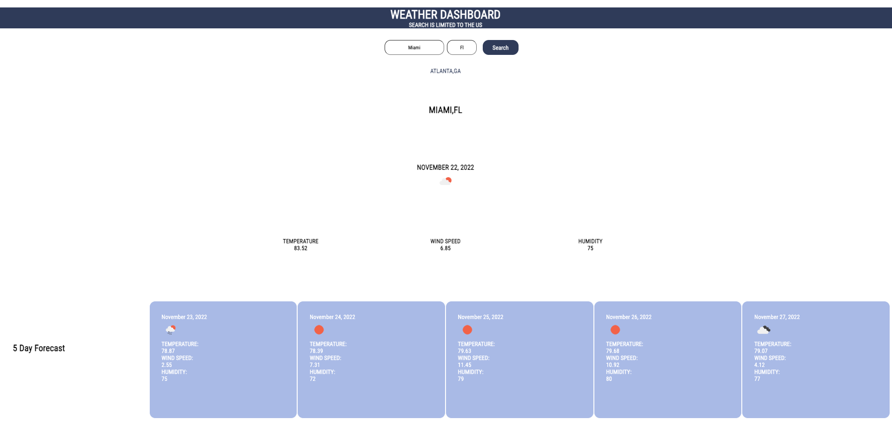

# weather-dashboard
Week 6 Weather Dashboard challenge to build a current and 5 day weather forecast app that saves historic searches in local storage. The app runs in browser and is dynamically updated using HTML, CSS and vanialla JavaScript. Completed the cahllenge by
1. Ensuring codebase is streamlined and and good accessibility
2. Using existing stylesheet setup to minimize code modification
3. Minimised weight of JavaScript to execute actions typically done using jquery


## User Story
```
AS A traveler
I WANT to see the weather outlook for multiple cities
SO THAT I can plan a trip accordingly
```


## Acceptance Criteria
```
GIVEN a weather dashboard with form inputs
WHEN I search for a city
THEN I am presented with current and future conditions for that city and that city is added to the search history
WHEN I view current weather conditions for that city
THEN I am presented with the city name, the date, an icon representation of weather conditions, the temperature, the humidity, and the wind speed
WHEN I view future weather conditions for that city
THEN I am presented with a 5-day forecast that displays the date, an icon representation of weather conditions, the temperature, the wind speed, and the humidity
WHEN I click on a city in the search history
THEN I am again presented with current and future conditions for that city
```

The following animation demonstrates the application functionality:




## Deployed Application Link
https://jae-as.github.io/weather-dashboard/
